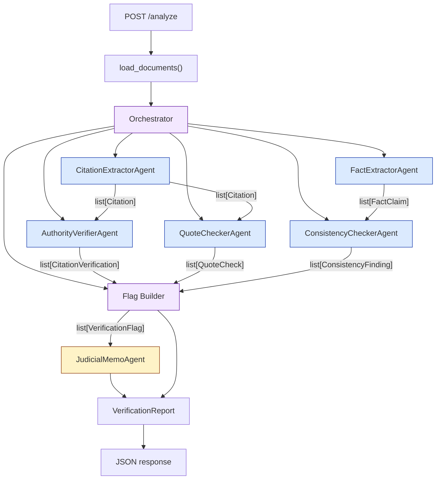
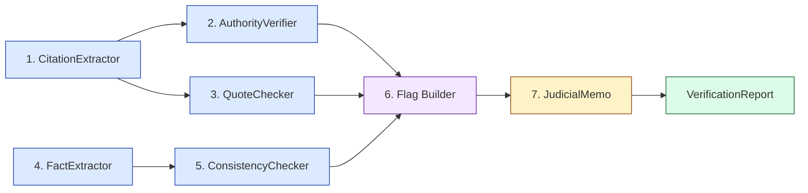
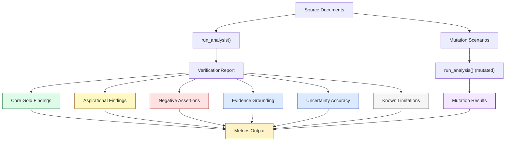

# Architecture

## Overview

The pipeline takes a set of legal documents (a Motion for Summary Judgment plus supporting source documents) and produces a structured verification report. It is organized as six specialized agents coordinated by an orchestrator, with Pydantic models flowing between them.



---

## Data Flow

All inter-agent communication uses typed Pydantic models defined in `backend/schemas.py`. No agent receives raw text blobs from another agent.

### Schema types

| Model | Purpose | Produced by | Consumed by |
|---|---|---|---|
| `Citation` | Extracted citation with proposition, quote, and context | CitationExtractor | AuthorityVerifier, QuoteChecker |
| `CitationVerification` | Whether the authority supports the proposition | AuthorityVerifier | Orchestrator (flag builder) |
| `QuoteCheck` | Whether a direct quote is accurate or overbroad | QuoteChecker | Orchestrator (flag builder) |
| `FactClaim` | Verifiable factual assertion from the MSJ | FactExtractor | ConsistencyChecker |
| `ConsistencyFinding` | Comparison of an MSJ claim against source documents | ConsistencyChecker | Orchestrator (flag builder) |
| `VerificationFlag` | Normalized finding with confidence, severity, and reasoning | Orchestrator | JudicialMemo |
| `AgentError` | Record of a failed agent run | Orchestrator | Report output |
| `VerificationReport` | Complete structured output | Orchestrator | API response |

### Status vocabulary

Every finding uses a shared status set so the eval harness can compare consistently:

| Status | Meaning |
|---|---|
| `supported` | Evidence confirms the claim |
| `partially_supported` | Evidence partially confirms but complicates the claim |
| `not_supported` | Authority or evidence does not support the proposition |
| `could_not_verify` | Insufficient information to make a determination |
| `likely_fabricated` | The cited authority appears to not exist |
| `contradicted` | Source documents directly contradict the MSJ claim |
| `not_found` | No supporting evidence found in provided documents |

---

## Agents

### 1. CitationExtractorAgent

**File:** `backend/agents/citation_extractor.py`

**Input:** Raw MSJ text

**Output:** `list[Citation]`

**Approach:** LLM-powered structured extraction. The agent asks the LLM to return validated JSON matching `CitationExtractionResult`. If the LLM is unavailable or returns invalid JSON, the orchestrator records an agent error rather than using a deterministic fallback.

**Proposition mapping:** Each recognized citation includes an LLM-extracted proposition summarizing what the MSJ uses it to support. This keeps the authority verifier and quote checker grounded in what the brief actually argues, rather than guessing.

### 2. AuthorityVerifierAgent

**File:** `backend/agents/authority_verifier.py`

**Input:** `list[Citation]`

**Output:** `list[CitationVerification]`

**Approach:** For each citation, assesses whether the cited authority actually supports the proposition as stated. Uses a conservative LLM-only strategy: well-known authorities (Privette, Seabright, CCP 335.1) receive cautious legal analysis; obscure or unverifiable authorities receive `could_not_verify` with low confidence.

**Key design decision:** The agent does not scrape legal websites or query a legal database. This was a deliberate tradeoff to avoid rate limits, paywalls, and fragility. The downside is that the agent cannot definitively confirm or deny obscure citations. It compensates by being explicit about uncertainty and by not fabricating holdings.

**Confidence scoring:** The LLM assigns confidence and a low/medium/high label in the structured response. Prompts instruct the model to stay conservative when it lacks primary source text.

### 3. QuoteCheckerAgent

**File:** `backend/agents/quote_checker.py`

**Input:** `list[Citation]` (filtered to those with direct quotes)

**Output:** `list[QuoteCheck]`

**Approach:** Checks direct quotes from the MSJ for accuracy or material overbreadth. The Privette "never liable" quote is flagged as overbroad because it omits recognized exceptions. All other quotes are marked `could_not_verify` because the pipeline does not have source authority text to compare against.

**Limitation:** Without retrieved case text, the agent can only flag overbreadth for well-known doctrine. It cannot verify word-for-word accuracy against the primary source.

### 4. FactExtractorAgent

**File:** `backend/agents/fact_extractor.py`

**Input:** Raw MSJ text

**Output:** `list[FactClaim]`

**Approach:** LLM-powered structured extraction. The agent asks the LLM to extract verifiable factual claims as JSON matching `FactExtractionResult`. The pipeline intentionally does not use keyword extraction fallback, because the repository is meant to evaluate LLM behavior.

This agent does not verify claims; it only identifies them for the consistency checker.

**Expected claim categories:**

| ID | Claim |
|---|---|
| `incident_date` | The incident occurred on March 14, 2021 |
| `no_ppe` | Rivera was not wearing required PPE |
| `osha_compliance` | Harmon passed all OSHA inspections |
| `apex_control` | Apex, not Harmon, controlled scaffolding operations |
| `filing_date` | Rivera filed the action on March 10, 2023 |
| `limitations_elapsed` | Rivera filed one year and 362 days after the incident |
| `immediate_injury` | Rivera's injuries were immediately apparent |

### 5. ConsistencyCheckerAgent

**File:** `backend/agents/consistency_checker.py`

**Input:** `list[FactClaim]` + source documents (dict)

**Output:** `list[ConsistencyFinding]`

**Approach:** Each claim ID maps to a dedicated checker method that inspects actual source document content. The checkers look for specific evidence strings in the police report, medical records, and witness statement, rather than returning fixed responses.

**This is the strongest part of the pipeline.** Cross-document comparison is grounded in actual document text, produces evidence snippets, and names the source documents. The date discrepancy and PPE discrepancy are both caught at high confidence (0.95 and 0.94) because multiple independent source documents directly contradict the MSJ.

**Mutation-aware:** Because the checkers inspect document content, the eval harness can mutate source documents and verify that findings change accordingly.

### 6. JudicialMemoAgent

**File:** `backend/agents/judicial_memo.py`

**Input:** `list[VerificationFlag]` (filtered to confidence >= 0.7)

**Output:** `str` (one paragraph)

**Approach:** Synthesizes high-confidence findings into a single neutral paragraph written for a judge. Only includes findings with confidence >= 0.7. Does not overstate low-confidence citation issues. Uses template-based assembly rather than free-form generation to avoid introducing hallucinations.

---

## Orchestrator

**File:** `backend/agents/orchestrator.py`

The orchestrator runs agents sequentially and builds the final report:



**Failure handling:** Each agent call is wrapped in `_safe_run`, which catches all exceptions. If an agent fails, its output is `None`, an `AgentError` is recorded, and later agents continue. The `/analyze` endpoint always returns a structured report; it never returns a 500 due to a single agent crash. Missing agent outputs produce empty lists for their sections.

**Flag deduplication:** The flag builder maintains a `flag_ids_seen` set so that the same issue (e.g., the Privette overbreadth) is not flagged once as a citation issue and again as a quote issue.

**Flag ID mapping:** Fact-claim IDs are mapped to human-readable flag IDs:

| Claim ID | Flag ID |
|---|---|
| `incident_date` | `date_discrepancy` |
| `no_ppe` | `ppe_discrepancy` |
| `osha_compliance` | `osha_compliance_unverified` |
| `apex_control` | `harmon_control_disputed` |
| `limitations_elapsed` | `limitations_argument_weak` |

---

## Confidence Scoring

Confidence is emitted by each agent, not by a separate scoring agent. The rationale: the agent closest to the evidence is best positioned to score certainty.

**Scoring rules:**

| Condition | Confidence | Label |
|---|---|---|
| Direct contradiction across multiple source documents | 0.85-0.95 | high |
| Single-source contradiction or complication | 0.70-0.86 | high |
| LLM-only legal assessment on well-known authority | 0.67-0.90 | medium-high |
| Obscure authority without source text | 0.30-0.45 | low |
| No available evidence | 0.20-0.40 | low |

Labels are assigned by threshold: `high` >= 0.75, `medium` >= 0.5, `low` < 0.5.

---

## API

**Endpoint:** `POST /analyze`

**File:** `backend/main.py`

Returns:
```json
{
  "report": {
    "case_name": "...",
    "judicial_memo": "...",
    "citations": [...],
    "citation_verifications": [...],
    "quote_checks": [...],
    "fact_claims": [...],
    "consistency_findings": [...],
    "flags": [...],
    "agent_errors": [...],
    "metadata": {
      "document_count": 4,
      "agents_run": ["CitationExtractorAgent", ...]
    }
  }
}
```

The endpoint uses `def` (not `async def`) because the current pipeline is synchronous. This follows the FastAPI guidance that blocking code should use plain `def` to run in a threadpool.

---

## Eval Architecture

**File:** `backend/run_evals.py`

**Command:** `cd backend && python run_evals.py`

The eval harness measures pipeline quality across seven dimensions. It is designed to report honest scores, including ones below 100%, rather than optimizing for perfect metrics on a single case file.



### Eval dimensions

#### 1. Core gold findings (precision + core_recall)

A set of six expected findings with semantic matching:

Each `ExpectedFinding` requires:
- Required semantic concepts present in finding text, with aliases for LLM wording variation
- Status within accepted set (for example, `contradicted` or `partially_supported` for a factual conflict)
- Confidence within min/max bounds

**Precision** = semantic core, weak, and aspirational matches / total flags produced

**Core recall** = matched core flags / 6 expected

#### 2. Aspirational findings (expanded_recall)

One additional expected finding that the current pipeline does **not** catch: the Seabright/OSHA insulation overstatement. This is a real issue in the MSJ that the flag layer does not yet promote.

**Expanded recall** = (matched core + matched aspirational) / (core + aspirational count)

This is intentionally stricter than the core set. The eval is more informative because it measures issues the pipeline may still miss.

#### 3. Negative assertions

Three true statements from the case file that should **not** be flagged as problems:
- "Rivera was employed by Apex"
- "2200 West Olympic Boulevard"
- "left leg, lower back, and left wrist"

If the pipeline flags any of these as contradictions, that is a false positive.

#### 4. Evidence grounding

For every `ConsistencyFinding` with a `source_evidence` snippet, the eval checks whether that snippet actually appears in a named non-MSJ source document. This is the most direct hallucination test for fact consistency: it verifies that the pipeline is not using the motion's own assertions as external evidence.

**Grounding rate** = grounded records / total records with evidence

#### 5. Uncertainty accuracy

For obscure citations (Whitmore, Kellerman, Torres), the eval checks that the pipeline returns `could_not_verify` with confidence <= 0.5. This rewards appropriate uncertainty rather than confident fabrication.

**Uncertainty accuracy** = correct uncertain calls / total obscure citations

#### 6. Mutation scenarios

Three document mutations that should cause specific flags to disappear:

| Mutation | Expected absent semantic finding |
|---|---|
| Change MSJ date to March 12 | March 14 vs March 12 date conflict |
| Change MSJ PPE text to say Rivera was wearing PPE | PPE-not-worn conflict |
| Remove Harmon direction evidence from police/witness docs | Harmon/Apex control dispute |

**Mutation pass rate** = passed scenarios / total scenarios

This tests whether the LLM is actually comparing evidence rather than repeating the same conclusions. The consistency checker receives the mutated document text, so these scenarios should change the model's output when the evidence changes.

#### 7. Adversarial cases

Two synthetic mini-cases test behavior outside the Rivera fixture:

| Case | Purpose | Metric |
|---|---|---|
| Clean mini-MSJ | Facts match source documents and should not produce contradiction flags | `clean_case_false_positive_rate` |
| Fabricated citation mini-MSJ | Contains `Imaginary Builders v. Phantom Safety, 999 F.9th 999 (9th Cir. 2099)` | `fabricated_citation_detection_rate` |

The fabricated-citation case is intentionally obvious. It verifies that generic citation extraction and the verifier's `likely_fabricated` path work, but it is not a substitute for real source-grounded citation lookup.

#### 8. Known limitations

Metrics that honestly expose pipeline weaknesses:

| Metric | What it measures | Expected value |
|---|---|---|
| `citation_extraction_recall` | Fraction of expected citations extracted by the LLM | Varies by model and prompt behavior |
| `authority_source_grounding_rate` | Fraction of authority checks grounded in retrieved source text | 0.0 unless primary authority text is supplied or retrieved |
| `quote_exact_verification_rate` | Fraction of quote checks verified against primary source text | 0.0 (no source text is retrieved) |

These metrics are not failures. They are honest measurements of what the pipeline cannot yet do.

### How to read these numbers

Important interpretation:

- **Precision is now semantic.** A flag with an LLM-generated ID can count if its text contains the expected concepts and its status/confidence are acceptable.
- **Weak matches are useful.** They indicate the model found the right issue but used an imperfect status or confidence score.
- **Hallucination means unsupported issue, not unexpected ID.** A real date or PPE conflict with an unexpected ID is no longer counted as hallucinated.
- **Citation extraction recall remains literal.** It still checks whether expected citation terms appeared in extracted citations, so missing `Id. at 702` is a real extraction miss.
- **Authority and quote grounding require actual primary text.** Model-written `source_basis` language is not enough to count as source-grounded.
- **Mutation tests are semantic.** They fail only if the same substantive issue remains after the evidence is corrected.

### Exit code

The eval exits non-zero if core gold findings are missed, if negative assertions produce false positives, if evidence snippets are ungrounded, if hallucinated flags are produced, or if mutation scenarios fail. Weak matches are reported but do not fail the run because they are useful LLM-quality diagnostics rather than total misses.

---

## What would improve

1. **Legal database retrieval:** The authority verifier and quote checker would be dramatically stronger with access to case-law text. Even scraping free legal sites would move authority_source_grounding_rate from 0.17 to something meaningful.

2. **General citation extraction:** The current implementation relies on the LLM to identify citations. A production system could still add retrieval or parser-assisted validation, but not as a silent substitute for the model in this eval repo.

3. **More extraction evals:** Citation and fact extraction use LLM JSON output, but the eval suite still needs more diverse brief formats to prove that path is reliable.

4. **More adversarial eval inputs:** The eval now includes a clean brief and an obvious fabricated case. It still needs subtle misquotes, plausible fake citations, and clean briefs with richer legal argument.

5. **Per-category metric reporting:** Separate recall for citation issues, quote issues, and fact-consistency issues would make it clearer where the pipeline is strong and where it is weak.

6. **Confidence calibration:** The confidence scores are hand-tuned. A production system would benefit from calibration against a labeled dataset.
