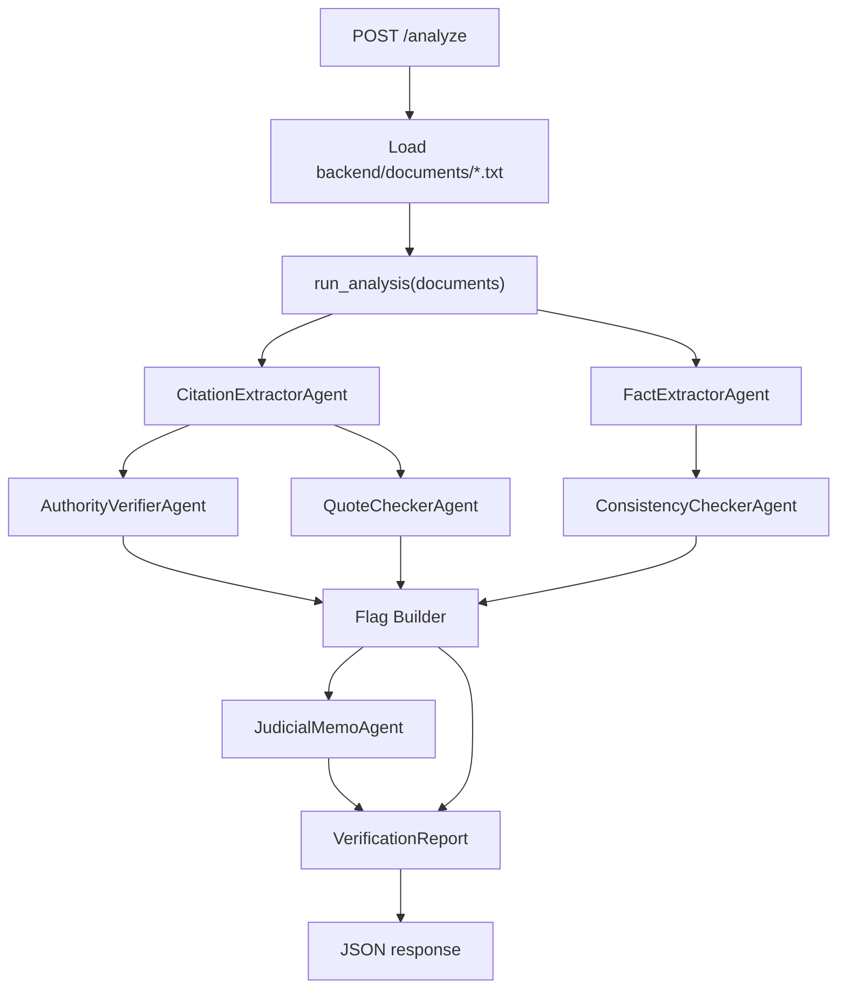

# Architecture

## Goal

BS Detector analyzes the provided Rivera case file and returns a structured verification report. The system is designed around the assignment tiers in `README.md`: extract citations, preserve uncertainty, compare the MSJ against the provided source documents, and produce a report that can be evaluated automatically.

The pipeline intentionally verifies only what the repository can actually support. The supplied documents include the MSJ, police report, medical records, and witness statement. They do not include primary case-law text or access to a trusted legal database. Because of that, legal citations and direct quotes are extracted, but legal-authority support and quote accuracy are marked `could_not_verify` unless source authority text is available.

This is a deliberate trust-boundary choice. Letting the model freely search the internet for cases could retrieve mismatched summaries, bad sources, or hallucinated authority analysis. The strongest source-grounded part of this implementation is therefore cross-document factual consistency.

## Tier Coverage

| README requirement | Implementation |
|---|---|
| Extract all citations from the MSJ | `CitationExtractorAgent` extracts citations, propositions, context, and direct quotes from `motion_for_summary_judgment.txt`. |
| Assess whether cited authority supports the proposition | `AuthorityVerifierAgent` records `could_not_verify` when primary authority text is not in the supplied case file. |
| Flag direct quotes for accuracy | `QuoteCheckerAgent` extracts direct quotes but marks accuracy `could_not_verify` without authority source text. |
| Produce structured JSON | `POST /analyze` returns a `VerificationReport` Pydantic schema. |
| Eval harness | `backend/run_evals.py` computes precision, recall, hallucination, grounding, uncertainty, mutation, and adversarial-case metrics. |
| Cross-document consistency | `ConsistencyCheckerAgent` compares MSJ fact claims against police, medical, and witness records. |
| Express uncertainty | Legal authority and quote checks avoid unsupported certainty and emit `could_not_verify`. |
| Structured data between agents | Agents pass Pydantic models, not prose blobs from prior agents. |
| 4+ agents | Six named agents plus an orchestrator and flag builder. |
| Confidence scoring | Findings include numeric confidence, confidence label, and reasoning. |
| Judicial memo | `JudicialMemoAgent` synthesizes top normalized flags into one paragraph. |
| Failure handling | The orchestrator records `AgentError` entries and returns a degraded structured report instead of crashing. |
| UI | React UI displays memo, key findings, citation checks, quote checks, consistency findings, errors, and raw JSON. |

## Runtime Flow



The orchestrator is synchronous and sequential. This keeps the implementation simple for the take-home, but citation/fact extraction and downstream checks could be parallelized later.

## Agents

| Agent | File | Input | Output | Responsibility |
|---|---|---|---|---|
| `CitationExtractorAgent` | `backend/agents/citation_extractor.py` | Raw MSJ text | `list[Citation]` | Extract legal citations, propositions, context, and direct quotes from the MSJ. |
| `AuthorityVerifierAgent` | `backend/agents/authority_verifier.py` | `list[Citation]` | `list[CitationVerification]` | Preserve uncertainty for legal authorities whose source text is not provided. |
| `QuoteCheckerAgent` | `backend/agents/quote_checker.py` | `list[Citation]` | `list[QuoteCheck]` | Report direct quotes and mark exact accuracy unverifiable without authority text. |
| `FactExtractorAgent` | `backend/agents/fact_extractor.py` | Raw MSJ text | `list[FactClaim]` | Extract factual claims that can be checked against the provided case file. |
| `ConsistencyCheckerAgent` | `backend/agents/consistency_checker.py` | `list[FactClaim]` and documents | `list[ConsistencyFinding]` | Compare MSJ facts against police report, medical records, and witness statement. |
| `JudicialMemoAgent` | `backend/agents/judicial_memo.py` | `list[VerificationFlag]` | `str` | Summarize the strongest normalized findings for a judge. |

## Data Model

All shared data structures live in `backend/schemas.py`.

| Model | Purpose |
|---|---|
| `Citation` | Citation extracted from the MSJ, including proposition and optional direct quote. |
| `CitationVerification` | Whether the cited authority can be verified from available source text. |
| `QuoteCheck` | Whether a direct quote can be verified from available source text. |
| `FactClaim` | Factual assertion extracted from the MSJ. |
| `ConsistencyFinding` | Result of comparing one MSJ fact claim against source documents. |
| `VerificationFlag` | Normalized issue shown in the report and UI. |
| `AgentError` | Recoverable agent failure recorded by the orchestrator. |
| `ReportMetadata` | Document count and list of completed agents. |
| `VerificationReport` | Complete API response payload. |

Shared statuses:

| Status | Meaning |
|---|---|
| `supported` | Evidence supports the claim. |
| `partially_supported` | Evidence supports part of the claim but complicates or qualifies it. |
| `not_supported` | Available evidence does not support the proposition. |
| `could_not_verify` | The pipeline lacks enough source material to decide. |
| `likely_fabricated` | Reserved for obviously impossible/facially fabricated authority. |
| `contradicted` | Source documents directly conflict with the MSJ claim. |
| `not_found` | No supporting evidence was found in the provided documents. |

## Source-Grounded Scope

The assignment asks for citation and quote verification, but the repository only provides factual case documents. This implementation handles that by splitting the problem:

| Check type | Source material available? | Behavior |
|---|---|---|
| MSJ factual claims | Yes: police, medical, witness records | Verify against provided documents and produce flags. |
| Legal citation support | No primary authority text | Extract citation, return `could_not_verify`. |
| Direct quote accuracy | No primary authority text | Extract quote, return `could_not_verify`. |
| Fabricated external citations | No legal database | Handle conservatively instead of claiming detection from memory. |

This avoids a misleading architecture where the LLM pretends to know the law. If trusted legal-source access were added later, the authority and quote agents are the natural integration points.

## Flag Builder

The orchestrator converts lower-level findings into normalized `VerificationFlag` records. These are the main user-facing issues displayed in the UI and scored by evals.

Fact-claim IDs are mapped to readable issue IDs:

| Claim ID | Flag ID |
|---|---|
| `incident_date` | `date_discrepancy` |
| `no_ppe` | `ppe_discrepancy` |
| `osha_compliance` | `osha_compliance_unverified` |
| `apex_control` | `harmon_control_disputed` |
| `limitations_elapsed` | `limitations_argument_weak` |

Citation and quote checks currently do not produce user-facing flags when they are merely `could_not_verify`; they remain visible in the structured report sections.

## Confidence

Each finding includes:

- `confidence`: numeric score from `0.0` to `1.0`
- `confidence_label`: `low`, `medium`, or `high`
- `reasoning`: short explanation

Current confidence policy:

| Condition | Confidence range | Label |
|---|---|---|
| Direct contradiction across multiple supplied documents | `0.85-0.95` | high |
| Single-source contradiction or complication | `0.70-0.86` | medium/high |
| Legal authority missing source text | `0.15-0.30` | low |
| No supporting evidence found | `0.20-0.40` | low |

The scores are intentionally simple. A production version should calibrate confidence against a larger labeled corpus.

## API

Endpoint: `POST /analyze`

File: `backend/main.py`

The endpoint loads every `.txt` file in `backend/documents/`, runs the orchestrator, and returns:

```json
{
  "report": {
    "case_name": "Rivera v. Harmon Construction Group",
    "judicial_memo": "...",
    "citations": [],
    "citation_verifications": [],
    "quote_checks": [],
    "fact_claims": [],
    "consistency_findings": [],
    "flags": [],
    "agent_errors": [],
    "metadata": {
      "document_count": 4,
      "agents_run": []
    }
  }
}
```

The endpoint is synchronous because the current pipeline is small and simple. Agent failures are caught by the orchestrator and surfaced in `agent_errors`.

## Eval Harness

Command:

```bash
cd backend
python run_evals.py
```

The eval harness measures whether the pipeline catches known issues without fabricating unsupported ones.

| Metric | Purpose |
|---|---|
| `precision` | How many emitted flags semantically match expected issues. |
| `core_recall` | How many source-grounded gold findings were caught. |
| `expanded_recall` | Includes aspirational findings outside the current source-grounded scope. |
| `hallucination_rate` | Flags unsupported by expected concepts or grounded evidence. |
| `evidence_grounding_rate` | Whether cited evidence snippets actually appear in non-MSJ source documents. |
| `uncertainty_accuracy` | Whether missing legal authority text produces `could_not_verify`. |
| `mutation_pass_rate` | Whether flags disappear when the underlying evidence is changed. |
| `clean_case_false_positive_rate` | Whether a clean synthetic case avoids false contradiction flags. |
| `fabricated_citation_conservative_handling_rate` | Whether unsupported external citations are handled conservatively. |
| `authority_source_grounding_rate` | Expected to be low/zero without supplied authority text. |
| `quote_exact_verification_rate` | Expected to be low/zero without supplied authority text. |

Core gold findings are focused on the provided record:

| Finding | Source-grounded issue |
|---|---|
| `date_discrepancy` | MSJ says March 14; source documents say March 12. |
| `ppe_discrepancy` | MSJ says Rivera lacked PPE; source documents say he wore it. |
| `osha_compliance_unverified` | MSJ claims OSHA compliance not established by provided documents. |
| `harmon_control_disputed` | MSJ frames Apex control as exclusive; source documents show Harmon direction. |
| `limitations_argument_weak` | Limitations framing is weak given the source-document incident date and filing date. |

## Tradeoffs

1. **No open-internet legal research:** avoids hallucinated or mismatched authority analysis, but limits legal citation verification.
2. **LLM extraction instead of deterministic parsers:** faster to build and flexible for this prompt, but citation/fact recall can vary by model.
3. **Single fixture evals:** useful for honest measurement, but not enough to prove general legal robustness.
4. **Synchronous orchestration:** simple and reliable for a small case file, but slower than parallel agent execution.
5. **Simple confidence scoring:** readable and explainable, but not calibrated against a larger dataset.

## What I Would Improve Next

1. Add trusted legal authority access or a user-supplied authority-text input path.
2. Add deterministic citation parsing before LLM proposition mapping.
3. Add exact evidence spans with document name, line numbers, and character offsets.
4. Add more synthetic and real eval fixtures.
5. Split eval reporting by citation extraction, fact consistency, quote checking, and hallucination.
6. Run independent agents in parallel and cache repeated document analyses.
